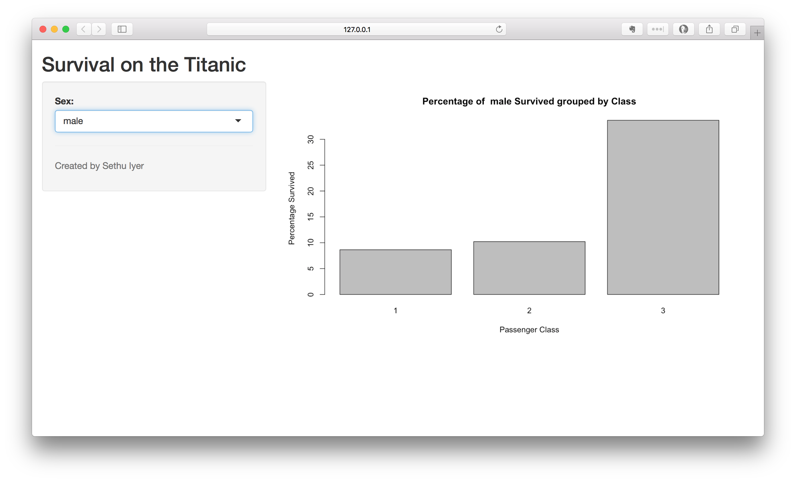

#Titanic Dataset WebApp using Shiny

User selects a gender and the interactive webapp shows the percentage of passenger survived per passenger class. Made using Shiny Package of R.

Here are some screenshots of the webapp.

